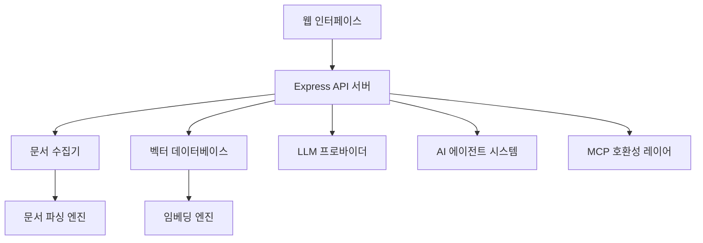

# AnythingLLM 코드베이스 분석 보고서

## 📋 개요

**AnythingLLM v1.8.5**는 개인 문서를 AI 채팅봇으로 변환하는 풀스택 애플리케이션입니다. 상용 및 오픈소스 LLM과 벡터 데이터베이스 솔루션을 사용하여 프라이빗 ChatGPT를 구축할 수 있는 강력한 플랫폼입니다.

## 🏗️ 아키텍처 개요

### 시스템 구성 요소

AnythingLLM은 6개의 주요 모듈로 구성된 모노레포입니다:

1. **Frontend** - ViteJS + React 기반 웹 인터페이스
2. **Server** - NodeJS Express 서버 (API 및 비즈니스 로직)
3. **Collector** - 문서 처리 및 파싱 서버
4. **Docker** - 컨테이너화 및 배포 설정
5. **Embed** - 웹 임베드 위젯 (서브모듈)
6. **Browser Extension** - Chrome 브라우저 확장 (서브모듈)

### 핵심 아키텍처 패턴



## 🔧 기술 스택 분석

### 프론트엔드 (React/Vite)
- **프레임워크**: React 18.2.0 with ViteJS
- **라우팅**: React Router DOM
- **스타일링**: TailwindCSS + PostCSS
- **국제화**: i18next
- **상태 관리**: React Context API
- **UI 컴포넌트**: @tremor/react, @phosphor-icons/react
- **특수 기능**: 
  - 드래그 앤 드롭 파일 업로드 (react-dropzone)
  - 실시간 채팅 스트리밍
  - TTS/STT 지원 (PiperTTS, 브라우저 내장)
  - QR 코드 생성

### 백엔드 (Node.js/Express)
- **런타임**: Node.js 18+ (ESM 모듈 지원)
- **프레임워크**: Express.js
- **데이터베이스**: 
  - 기본: SQLite (Prisma ORM)
  - 지원: PostgreSQL
- **인증**: JWT + bcrypt
- **웹소켓**: @mintplex-labs/express-ws
- **작업 스케줄링**: @mintplex-labs/bree
- **API 문서**: Swagger/OpenAPI

### 문서 처리 시스템
- **파일 형식 지원**: PDF, DOCX, TXT, EPUB, HTML, 오디오/비디오 등
- **OCR**: Tesseract.js
- **오디오 변환**: Fluent-ffmpeg, Whisper
- **웹 스크래핑**: Puppeteer
- **텍스트 분할**: LangChain TextSplitters

## 🧠 AI 모델 통합

### 지원 LLM 프로바이더 (25개)
- **상용**: OpenAI, Azure OpenAI, Anthropic, Google Gemini, AWS Bedrock
- **오픈소스**: Ollama, LM Studio, LocalAI, Hugging Face
- **클라우드**: Together AI, Fireworks AI, Groq, Cohere, Perplexity
- **특수**: NVIDIA NIM, xAI, Mistral, DeepSeek, Moonshot AI

### 임베딩 엔진 (12개)
- AnythingLLM Native Embedder (기본값)
- OpenAI, Azure OpenAI, LocalAI, Ollama
- LM Studio, Cohere, Voyage AI, Mistral

### 벡터 데이터베이스 (10개)
- **기본**: LanceDB
- **클라우드**: Pinecone, Astra DB, Chroma Cloud, Zilliz
- **자체 호스팅**: PGVector, Chroma, Weaviate, Qdrant, Milvus

## 📊 데이터 플로우 분석

### 문서 처리 파이프라인
1. **업로드**: 사용자가 파일 업로드 또는 URL 제공
2. **수집**: Collector 서버가 파일 타입 감지 및 변환
3. **파싱**: 적절한 파서를 통해 텍스트 추출
4. **청킹**: LangChain을 사용하여 텍스트 분할
5. **임베딩**: 선택된 임베딩 엔진으로 벡터 생성
6. **저장**: 벡터 데이터베이스에 저장

### 채팅 시스템 플로우
1. **사용자 입력**: 프론트엔드에서 메시지 전송
2. **컨텍스트 검색**: 벡터 유사도 검색으로 관련 문서 찾기
3. **프롬프트 구성**: 시스템 프롬프트 + 컨텍스트 + 사용자 질문
4. **LLM 호출**: 선택된 LLM 프로바이더로 응답 생성
5. **스트리밍**: 실시간으로 응답을 클라이언트에 전송

## 🔐 보안 및 권한 관리

### 사용자 권한 시스템
- **역할**: admin, manager, default
- **멀티테넌시**: 워크스페이스 기반 격리
- **API 키**: 개발자 API 접근 제어
- **세션 관리**: JWT 토큰 + 임시 인증 토큰

### 보안 기능
- 비밀번호 복잡성 검증 (joi-password-complexity)
- CORS 정책 적용
- 파일 업로드 크기 제한 (3GB)
- 사용자 일일 메시지 제한

## 🚀 고급 기능

### AI 에이전트 시스템
- **에이전트 플로우**: 코드 없는 AI 에이전트 빌더
- **웹소켓 통신**: 실시간 에이전트 상호작용
- **MCP 호환성**: Model Context Protocol 지원
- **도구 통합**: 웹 브라우징, 문서 검색 등

### 임베드 시스템
- **웹 위젯**: 웹사이트에 채팅 위젯 임베드
- **API 호환성**: OpenAI API 호환 엔드포인트
- **모바일 지원**: 전용 모바일 앱 연동

### 확장성 기능
- **실시간 문서 동기화**: 외부 소스와 자동 동기화
- **커뮤니티 허브**: 설정 공유 및 트렌딩
- **브라우저 확장**: 웹 페이지 직접 수집

## 📈 성능 최적화

### 벡터 검색 최적화
- **리랭킹**: 고급 벡터 검색 모드 지원
- **캐싱**: 벡터 캐시를 통한 재처리 방지
- **청킹 전략**: 토큰 기반 적응형 청킹

### 메모리 및 처리 최적화
- **스트리밍**: 대용량 응답의 실시간 스트리밍
- **백그라운드 처리**: Bree를 통한 비동기 작업 처리
- **파일 정리**: 임시 파일 자동 정리 작업

## 🛠️ 개발 및 배포

### 개발 환경 설정
```bash
# 초기 설정
yarn setup

# 개발 서버 실행 (별도 터미널)
yarn dev:server
yarn dev:frontend  
yarn dev:collector
```

### 배포 옵션
- **Docker**: 완전한 컨테이너화 지원
- **클라우드**: AWS, GCP, DigitalOcean, Railway 등
- **베어메탈**: 직접 서버 설치 지원

### 데이터베이스 관리
- **Prisma ORM**: 스키마 마이그레이션 및 시드
- **SQLite**: 기본 개발 환경
- **PostgreSQL**: 프로덕션 권장

## 📊 텔레메트리 및 모니터링

### 텔레메트리 수집
- PostHog를 통한 익명 사용 통계
- 설치 유형, 문서 추가/제거 이벤트
- LLM/벡터DB 사용 패턴 추적
- 채팅 빈도 모니터링

### 로깅 시스템
- Winston 기반 구조화된 로깅
- 개발/프로덕션 환경별 로그 레벨
- 에러 추적 및 디버깅 지원

## 🌍 국제화 및 접근성

### 다국어 지원
- **지원 언어**: 영어, 중국어(간체), 일본어, 터키어, 페르시아어 등
- **번역 관리**: i18next를 통한 동적 로딩
- **검증 도구**: 번역 누락 및 정규화 스크립트

### 접근성
- 키보드 단축키 지원
- 스크린 리더 호환성
- 반응형 디자인 (모바일/데스크톱)

## 🔮 확장 가능성

### 플러그인 아키텍처
- **MCP 서버**: 외부 도구 통합
- **확장 시스템**: 커스텀 문서 처리기
- **API 확장**: 개발자 친화적 REST API

### 클라우드 네이티브
- **수평 확장**: 마이크로서비스 아키텍처 준비
- **컨테이너화**: Docker 완전 지원
- **오케스트레이션**: Kubernetes 매니페스트 제공

## 📈 코드 품질 지표

### 코드베이스 구조
- **총 파일 수**: 1,000+ 파일
- **주요 언어**: JavaScript (Node.js), JSX (React)
- **코드 품질**: ESLint + Prettier 적용
- **테스트**: Jest 기반 유닛 테스트

### 의존성 관리
- **프론트엔드**: 50+ npm 패키지
- **백엔드**: 80+ npm 패키지  
- **수집기**: 55+ npm 패키지
- **보안**: 정기적인 의존성 업데이트

## 🏆 주요 특장점

### 1. **완전한 프라이버시**
- 온프레미스 배포 가능
- 외부 의존성 최소화
- 데이터 완전 제어

### 2. **광범위한 호환성**
- 25개 LLM 프로바이더 지원
- 10개 벡터 데이터베이스 지원
- 다양한 문서 형식 처리

### 3. **확장 가능한 아키텍처**
- 모듈화된 설계
- 플러그인 시스템
- API 우선 접근법

### 4. **사용자 친화적**
- 직관적인 웹 인터페이스
- 드래그 앤 드롭 지원
- 실시간 스트리밍

### 5. **엔터프라이즈 준비**
- 멀티유저 지원
- 역할 기반 권한 관리
- API 키 관리

## 🔄 향후 발전 방향

### 단기 목표
- MCP 호환성 확대
- 에이전트 플로우 고도화
- 성능 최적화

### 장기 비전
- 분산 아키텍처 구현
- 플러그인 생태계 확장
- AI 모델 파인튜닝 지원

---

## 📝 결론

AnythingLLM은 현대적인 웹 기술 스택을 기반으로 구축된 매우 포괄적이고 확장 가능한 AI 플랫폼입니다. 모듈화된 아키텍처, 광범위한 통합 지원, 그리고 사용자 중심적 설계를 통해 개인부터 기업까지 다양한 요구사항을 충족할 수 있는 강력한 솔루션을 제공합니다.

특히 프라이버시를 중시하는 환경에서 상용 수준의 AI 채팅 시스템을 구축하고자 하는 조직에게 이상적인 선택이 될 것입니다.

---

*이 분석은 AnythingLLM v1.8.5 코드베이스를 기반으로 작성되었습니다.*  
*분석 일자: 2025년 1월*
